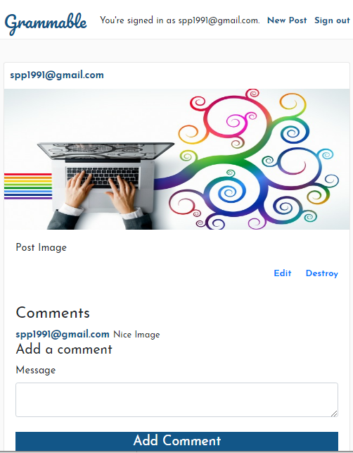
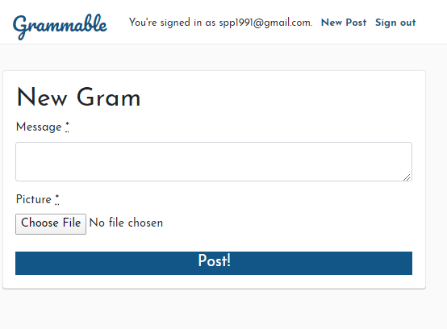

# Grammable 

This application allows users to create/edit/destroy post and allows users (including the user who created the post) to submit comment on the post. Each user is required to sign up before taking any action (create/edit/destroy post, post a comment)

This application was developed using test driven development approach which allows developer to ensure that application functionalities are working before any new code changes are commited . Rspec gem is used to develop test for the application and AWS cloud storage platform is used to store images associated with each post.

Technical details of the app is as follows :
- Programming Language: Ruby, javascript, HTML5
- Web/stylesheet Framwork : ruby on rails, bootstrap  
- Database : postgresql
- Gems : rspec, factorybot, carrierwave, fog-aws
- Cloud Storage Platform ; Amazon Web Service (AWS)

Note : Please execute commands to install all gems ('bundle install') and create/migrate database/tables('rails db:create , rails db:migrate') before git repository of this application is downloaded and used to run on local server 

To checkout the application, click [here](https://grammable-sunnypatel.herokuapp.com/) 

## Home Page

## New Gram Page

